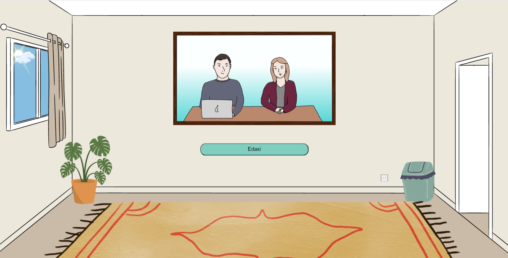

Haridustehnoloogia õppekava sisseastumisintervjuu simulaator.

Simulaatori eesmärk on sarnaneda päris sisseastumisintervjuuga ja aidata sisseastujatel valmistuda ning aru saada, mis neid ees ootab. Samuti annab simulaator õppejõududele ülevaate erinevatest inimestest, kes on huvitatud antud õppekavast ja harjutavad intervjuuks. Simulaator aitab vähendada sisseastujate ärevust ning ka tõsta tudengite kvaliteeti.

Projekt on loodud suvepraktika raames haridustehnoloogia õppekava jaoks, et aidata tulevastel sisseastujatel valmistuda päris sisseastumisintervjuuks ning vähendada nende ärevust.

Kasutatud tehnoloogiad: 
HTML5
PHP Version 8.0.13
MySQL 5.2.0-1.el9
MariaDB 10.5.16
phpmyadmin 5.2.0-1
Apache/2.4.51
Javascript1.5

Autorid: Merette Arula, Annabel Väljaots, Aron Paco Vunk, Rocco Kärson

Paigaldusjuhend: kõik koodid koos taustapildi ja videotega panna ühise kaustana public_html kausta ning public_html-ist välja panna config.php, mis sisaldab andmebaasi paroole. Paroolid ja muu info edastatakse tellijale privaatselt. 

Simulaator loeb sisse küsimused CSV failist mis on paigutatud intervjuu_simulaator kausta faili kysimused.csv. Selles failis on küsimused mida simulaator kasutajale näitab. 
Täpsemad juhised, kuidas teha uut csv faili ja seda ülesse laadida on kasutusjuhendis. 
